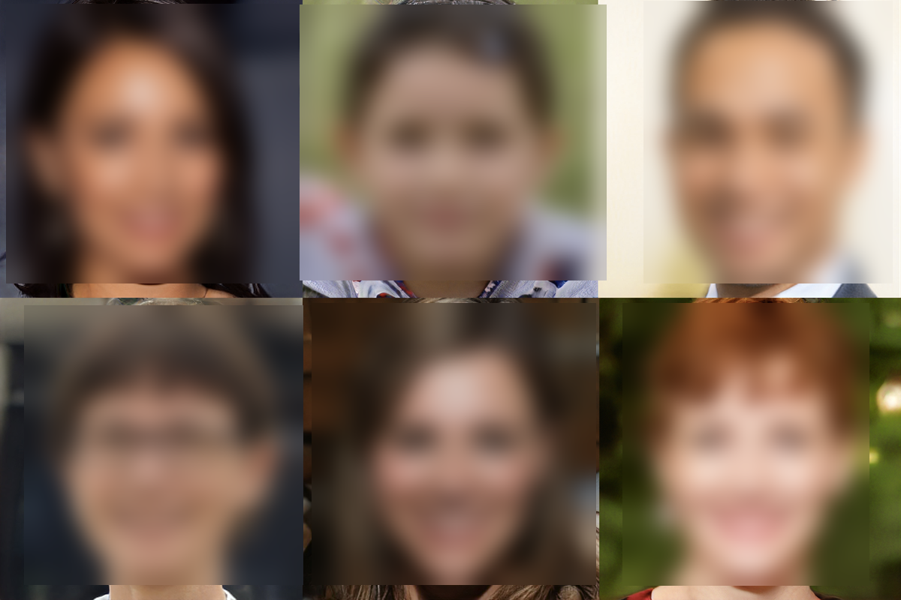

# Blur objects using yolov3



This repository can be used to blur people from images or video. It uses Yolov3, pytorch and opencv.

## :hammer: How to setup?

Some initial configuration is required to run things. First we need to install all the python dependencies, and then download the network weights.

- (Optional) If you want GPU acceleration, you've got two options. Either [install pytorch with CUDA dependencies](https://pytorch.org/get-started/locally/) or [install CUDA seperately](https://docs.nvidia.com/cuda/cuda-installation-guide-linux/index.html).

- After having activated your favorite virtual environment, install the required packages using `pip` by running `pip install -r requirements.txt`. You might wanted to consider installing `numpy`, `scipy` and `sklearn` libraries using `conda`, as they are compiled with CPU-specific optimizations which can [speed things up quite a bit](http://markus-beuckelmann.de/blog/boosting-numpy-blas.html).

- Next up is downloading the YOLO network weights. You can do this by either download them [here](https://github.com/pjreddie/darknet) or by running `wget https://pjreddie.com/media/files/yolov3.weights`. Once the download is compete, place the `yolov3.weights`  in the weights folder.

## :arrow_forward: How to use?


```
usage: blur.py [-h] -i INPUT [-t OBJ_THRESH] [-n NMS_THRESH]
                        [--min-hits MIN_HITS] [--max-age MAX_AGE] [-o OUTDIR]
                        [-w] [--debug-trackers] [--cuda] [--no-show] [-c BLUR] [-b BLURCOLOR]

Object detection/tracking with YOLOv3 and SORT

optional arguments:
  -h, --help            show this help message and exit
  -i, --input INPUT     input directory or video
  -t, --obj-thresh OBJ_THRESH
                        objectness threshold, DEFAULT: 0.5
  -n, --nms-thresh NMS_THRESH
                        non max suppression threshold, DEFAULT: 0.4
  --min-hits MIN_HITS   A tracker needs to match a bounding box for at least
                        this many frames before it is registered. Prevents
                        false positives
  --max-age MAX_AGE     The number of frames a tracker is kept alive without
                        matching bounding boxes. Useful for tracker while an
                        object is temporarily blocked
  -o, --outdir OUTDIR output directory, DEFAULT: output/
  -w, --webcam          flag for detecting from webcam. Specify webcam ID in
                        the input. usually 0 for a single webcam connected
  -c, --blurclasses     What classes to blur, DEFAULT: ['person','truck', 'car','motorbike']
  -b, --blurcolor     What type of blur to use, DEFAULT: blur. Can also be a color, for black: (0,0,0)

```

## :tada: Who made this possible?

This project wouldn't be possible without all the hard work on these projects:

- [Pytorch implementation of real time object detection algorithm YOLOv3](https://github.com/zhaoyanglijoey/yolov3)

